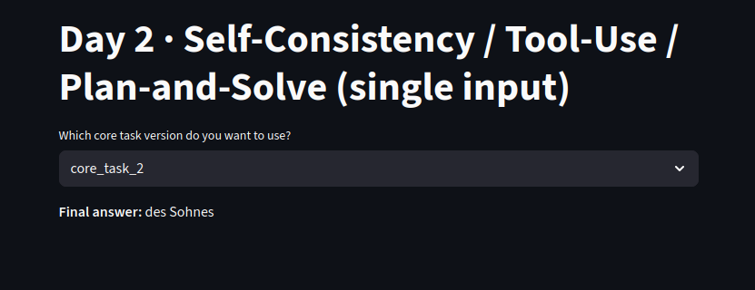
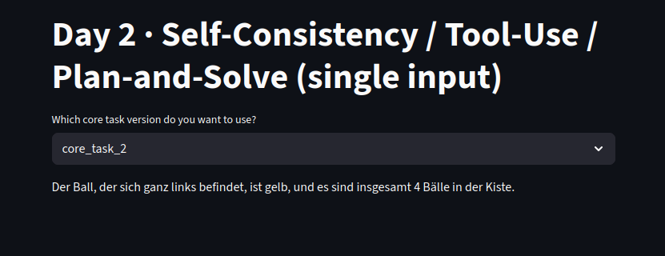

# Tag 2: Fortgeschrittene Reasoning-Techniken mit LLMs

## 🎯 Lernziele

Am Ende dieses Labs wirst du in der Lage sein:

1.  **Chain-of-Thought (CoT)**: LLMs durch schrittweise Anweisungen zu komplexen logischen Schlussfolgerungen zu führen.
2.  **Self-Consistency**: Die Zuverlässigkeit und Genauigkeit von LLM-Antworten durch die Aggregation mehrerer Lösungswege signifikant zu verbessern.
3.  **Anspruchsvolle Probleme zu lösen**: Beide Techniken zu kombinieren, um Probleme zu knacken, die für Standard-LLM-Ansätze zu komplex sind.

## 📝 Kernaufgaben

In diesem Lab implementierst du die beiden grundlegenden Techniken und wendest sie auf eine Auswahl anspruchsvoller Probleme an.

---

### Task 1: Implementierung von Chain-of-Thought (CoT)

Deine erste Aufgabe ist es, eine allgemeine Funktion zu erstellen, die ein beliebiges Problem entgegennimmt und es mithilfe einer CoT-Anweisung für das LLM aufbereitet.

-   **Implementiere einen CoT-Wrapper:**
    -   Erstelle eine Funktion `solve_with_cot(problem_description)`.
    -  Implementiere darin CoT Vorgehen und löse einige der Beispielprobleme.
    -   Sende den formatierten Prompt an das LLM und gib die vollständige, schrittweise Antwort zurück.

---

### Task 2: Implementierung von Self-Consistency

Deine zweite Aufgabe ist es, einen Self-Consistency-Mechanismus zu bauen, der eine CoT-Funktion mehrfach aufruft, um die robusteste Antwort zu finden.

-   **Implementiere den Self-Consistency-Mechanismus:**
    -   Erstelle eine Funktion `solve_with_self_consistency(problem_description, count=5)`.
    -   Diese Funktion ruft deine `solve_with_cot`-Funktion in einer Schleife (z.B. 5-mal) auf. **Wichtig:** Setze die `temperature` des Modells auf einen Wert > 0 (z.B. `0.6`), um vielfältige Lösungswege zu erhalten.
    -   Extrahiere aus jeder Antwort die finale, extrahierte Antwort (z.B. eine Zahl, ein Wort oder einen Satz).
    -   Ermittle die am häufigsten genannte Antwort (Mehrheitsentscheid) und gib sie als finales Ergebnis zurück.

---

## 💡 Beispielaufgaben zur Anwendung

Wähle **mindestens zwei** der folgenden Probleme aus, um deine Implementierungen zu testen. Versuche, sie sowohl nur mit CoT als auch mit der Kombination aus CoT und Self-Consistency zu lösen. Analysiere die Ergebnisse: Wo verbessert Self-Consistency die Antwort signifikant?

### Aufgabe A: Das Porträt (Logische Deduktion)
Ein Mann schaut auf ein Porträt. Jemand fragt ihn, wessen Porträt er betrachtet. Er antwortet: "Brüder und Schwestern habe ich keine, aber der Vater dieses Mannes ist der Sohn meines Vaters." Wessen Porträt betrachtet der Mann?

### Aufgabe B: Die Bälle im Korb (Zustandsverfolgung)
Du hast eine Kiste mit drei Bällen: einem roten, einem grünen und einem blauen, in dieser Reihenfolge von links nach rechts. Du führst die folgenden fünf Aktionen nacheinander aus:
1.  Du nimmst den roten Ball und tauschst ihn mit dem blauen Ball.
2.  Du hebst den Ball in der Mitte auf und legst ihn ganz nach rechts.
3.  Du nimmst den ganz links liegenden Ball und tauschst ihn mit dem ganz rechts liegenden Ball.
4.  Du nimmst den ganz links liegenden Ball und färbst ihn gelb.
5.  Du legst einen neuen lila Ball in die Mitte der Reihe.
Welche Farbe hat der Ball, der sich ganz links befindet, und wie viele Bälle sind jetzt insgesamt in der Kiste?

### Aufgabe C: Früchte im Korb (Indirekte Berechnung)
In einem Korb sind dreimal so viele Äpfel wie Birnen. Es sind halb so viele Birnen wie Pfirsiche. Es gibt 24 Pfirsiche. Wenn 1/3 der Äpfel, die Hälfte der Birnen und 1/4 der Pfirsiche grün sind, wie viele Früchte im Korb sind *nicht* grün?

### Aufgabe D: Die Flugreise (Zeitzonen & Logik)
Ein Flugzeug startet am Dienstag um 22:00 Uhr Ortszeit in Tokio (UTC+9). Der Flug nach New York (UTC-4) dauert genau 13 Stunden. Welcher Wochentag und welche Uhrzeit ist es in New York, wenn das Flugzeug landet?

### Aufgabe E: Das Spiel mit den Münzen (Spieltheorie)
Zwei Spieler, A und B, spielen ein Spiel mit einem Haufen von 21 Münzen. Abwechselnd dürfen sie 1, 2 oder 3 Münzen vom Haufen nehmen. Der Spieler, der die letzte Münze nimmt, gewinnt. Spieler A beginnt. Welche Strategie muss Spieler A verfolgen, um garantiert zu gewinnen? Welchen ersten Zug muss er machen?

---

## 🛠️ Implementierungsrichtlinien

-   Implementiere deine Lösungen in der Datei `router.py`. Erstelle am besten separate Endpoints wie `/solve-cot` und `/solve-self-consistency`, die einen Problemtext entgegennehmen.
-   Achte auf eine saubere Fehlerbehandlung.
-   Dokumentiere deinen Code und deine Vorgehensweise.

